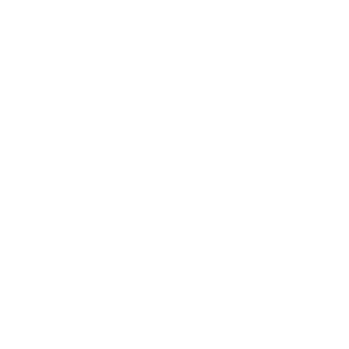

<h1 align="center">BulkMods</h1>

### Downloads
<h1 aling="left"></h1>

this mod is simply just a collection of some simple mods that I have created for testing purposes.

I hope they are working and good.

:)

